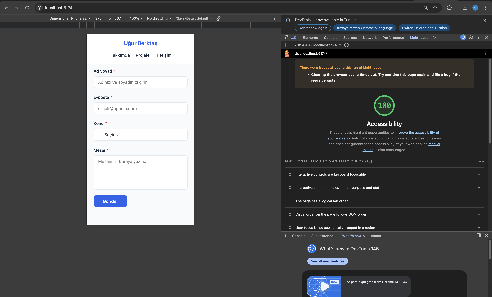

# Web LAB-1

## Hakkında

Bu proje, **Web Tasarımı ve Programlama** dersi LAB-1 kapsamında **Vite + React + TypeScript** kullanılarak oluşturulmuştur.

---

## Geliştirici

- **Ad Soyad:** Uğur Berktaş
- **Öğrenci No:** [Buraya numaranı yaz]

---

## Kullanılan Teknolojiler

- ⚛️ React 18
- 🟦 TypeScript
- ⚡ Vite

---

## Kurulum

```bash
npm install
```

## Çalıştırma

```bash
npm run dev
```

> Tarayıcıda [http://localhost:5173](http://localhost:5173) adresini aç.

---

## Ekran Görüntüsü

### Lighthouse Erişilebilirlik Skoru



> ♿ Google Lighthouse **Accessibility skoru: 100/100**
